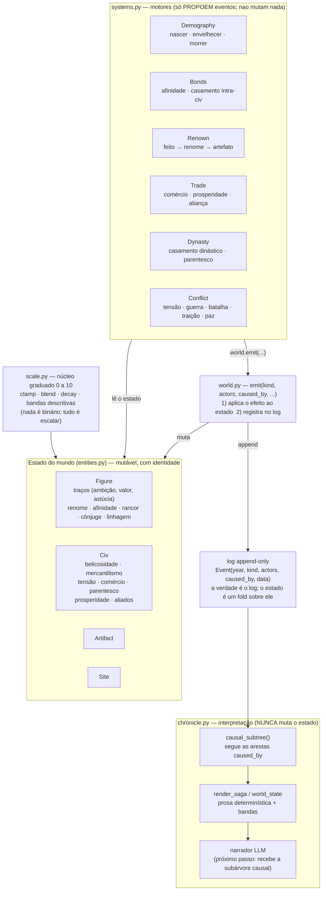
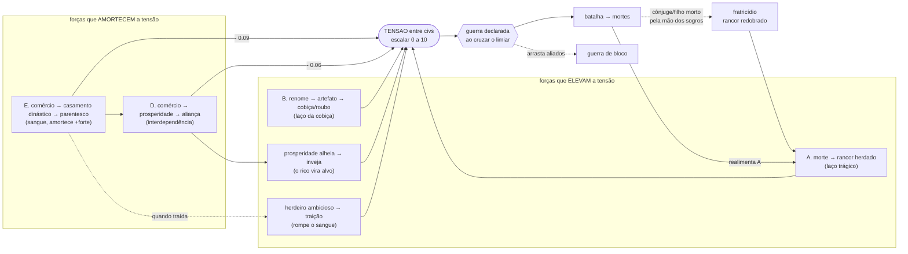

# Cronista — arquitetura, comparação com Dwarf Fortress e roadmap

Este documento mapeia o sistema construído até aqui (cinco laços de
realimentação sobre um núcleo de *event sourcing* graduado), compara-o com o
que se sabe do gerador de história do Dwarf Fortress (o modo Legends / a
geração de mundo) e propõe direções de crescimento ancoradas na arquitetura que
já existe.

---

## 1. Arquitetura atual

O sistema tem quatro camadas com uma separação estrita: um núcleo graduado, um
estado mutável, um log que é a verdade, e uma camada de interpretação que nunca
toca no estado.

### Os cinco laços que disputam entre si

A história emerge de um cabo de guerra: três forças elevam a tensão entre civs
(empurrando para a guerra) e duas a amortecem (empurrando para a paz). O binário
"houve guerra" é sempre um resultado de escalares contínuos cruzando um limiar.

| Laço | Cadeia | Empurra para |
|------|--------|--------------|
| **A — trágico** | morte em batalha → rancor herdado pela linhagem → tensão → guerra → morte | guerra |
| **B — cobiça** | feito → renome → artefato → cobiça/roubo → tensão | guerra |
| **C — linhagem** | afinidade → casamento → nascimento (herda rancor) | alimenta A |
| **D — comércio** | paz → comércio → prosperidade → aliança; amortece tensão; prosperidade → inveja | paz (e um pouco de guerra) |
| **E — dinástico** | comércio → casamento dinástico → parentesco → aliança durável; traição → fratricídio | paz (e a guerra mais escura) |

---

## 2. Comparação com o Dwarf Fortress

O DF gera história num mundo *físico* simulado em altíssima resolução; o cronista
é, por escolha, um **gerador de lendas** — abstrai o mundo físico e foca na
causalidade histórica. A comparação abaixo não é uma lista de tarefas, e sim um
mapa de qual eixo de profundidade cada sistema privilegia.

| Dimensão | Cronista hoje | Dwarf Fortress (Legends / worldgen) |
|---|---|---|
| **Substrato físico** | Sites como rótulos, sem espaço nem geografia | Geologia, clima, biomas, rios, erosão, minérios — um mapa real que condiciona tudo |
| **Causalidade** | Grafo causal explícito (`caused_by`), determinístico e testável | História registrada, com ligações causais mais frouxas e implícitas |
| **Civilizações e cultura** | Traços numéricos (belicosidade, mercantilismo) | Raças, ética/valores, esferas divinas, posições, estrutura de nobreza |
| **Divindades e religião** | — | Deuses, esferas, religiões, templos, e (versões novas) mitos de criação gerados |
| **Indivíduos** | Traços + afinidade/rancor/cônjuge/linhagem | Personalidade multifacetada, necessidades, muitos tipos de relação, perícias |
| **Sítios e território** | Estáticos | Fundação, migração, conquista, ocupação, saque, arrasamento |
| **Artefatos** | Nome + fama, roubáveis | Materiais específicos, decorações que **retratam eventos históricos**, maldições, viram alvo de missões |
| **Mundo não-civilizado** | — | Megabestas, titãs, feras esquecidas, criaturas da noite |
| **Maldições** | — | Vampiros, lobisomens, necromantes e suas torres |
| **Intriga** | Só a traição dinástica | Agentes, tramas, sequestro, roubo, organizações criminosas |
| **Conhecimento** | — | Filosofia, matemática, bibliotecas, obras escritas, descobertas |
| **Cultura gerada** | Nomes procedurais | Formas de arte, poesia, dança e música geradas proceduralmente |
| **Economia** | Prosperidade abstrata (escalar) | Guildas, mercenários, moeda, ofícios |
| **Sucessão e liderança** | — | Posições formais, nobreza, sucessão de líderes |

### O que o cronista já faz que o DF **não** enfatiza

Vale registrar as vantagens estruturais, porque elas definem para onde crescer
com baixo custo:

- **Event sourcing limpo com grafo causal explícito.** No DF as ligações
  causais são frouxas; aqui cada evento aponta para seus pais, então uma saga se
  reconstrói exatamente. Isso é ouro para um narrador LLM.
- **Determinismo e reprodutibilidade.** Mesma seed, log idêntico byte a byte —
  testável, versionável, comparável. O DF não busca isso.
- **Uniformidade graduada.** Como tudo é escalar `[0,10]` + limiar → evento,
  adicionar um subsistema novo é sempre o mesmo padrão. O custo marginal de um
  novo laço é baixo.
- **Costura pronta para o LLM.** `causal_subtree()` entrega a saga fechada de
  qualquer evento como contexto — a mecânica permanece determinística.

---

## 3. Para onde crescer

Priorizado por **alavancagem sobre a arquitetura atual** — o que rende mais
história por unidade de código, dado o núcleo graduado e o log causal.

### Tier 1 — barato e transformador (encaixa direto no que existe)

**1. Geografia como substrato.** Dar coordenadas aos `Site` e uma distância
entre civs. A distância entra como mais um termo graduado: modula o comércio
(rotas curtas comerciam mais) e a tensão (fronteiras próximas atritam). Custo
baixíssimo — é um escalar a mais nas fórmulas que já existem — e destrava tudo
que é territorial. Transforma pares abstratos num mapa.

**2. Artefatos e crônicas reflexivos.** Fazer artefatos e livros *retratarem
eventos específicos* do passado, usando o grafo `caused_by` que já temos. Um
artefato forjado guarda o id de uma batalha; sua decoração "narra" aquela saga.
Quase de graça dado o event sourcing, é uma das assinaturas mais fortes do DF, e
dá contexto riquíssimo ao narrador LLM (o mundo passa a conter suas próprias
lendas).

**3. Líderes e sucessão.** Um `Figure` líder por civ; sua morte dispara uma
sucessão. Conecta os laços C/E ao poder e destrava as **reivindicações de
sucessão** que já esboçamos: um filho de união dinástica com sangue na outra
civ pode herdar um trono vago — ou uma guerra de sucessão. É o desdobramento
natural do laço E.

### Tier 2 — novos eixos de pressão (criam heróis e realinham a política)

**4. Megabestas e o mundo não-civilizado.** Uma ameaça externa que heróis
abatem (gerando renome, fechando no laço B) e que pode *unir* civs rivais
temporariamente — uma força que empurra para a paz por um caminho novo (o
inimigo comum). O DF apoia metade de suas lendas nisso.

**5. Ideologia, valores e religião.** Vetores de valores por civ; a *distância*
entre vetores vira mais um termo de tensão/afinidade (exatamente o padrão do
comércio, mas cultural). Deuses e esferas dão nome e cor às civs. É o eixo em
que o cronista é hoje mais raso frente ao DF, e o mais "de graça" de modelar
como escalar.

**6. Dinâmica de sítios.** Fundação, conquista, arrasamento e migração. Faz a
guerra ser *territorial* (tomar/perder sítios) e não só atrito de população —
muda a natureza das sagas de guerra.

### Tier 3 — profundidade sobre o que já existe

- **Indivíduos mais ricos:** perícias além de `valor`, facetas de personalidade
  que enviesam decisões, mais tipos de relação (amizade, rivalidade, mentoria).
- **Subsistema de intriga:** tramas, assassinato, sequestro — estende a traição
  para um leque de ações encobertas (usa `astucia`, já presente e subusada).
- **Economia com recursos:** o que alimenta a prosperidade deixa de ser abstrato
  (bens, minérios ligados à geografia do Tier 1), guildas, mercenários.
- **Cultura gerada:** formas de arte/poesia que retratam eventos — a face
  criativa dos artefatos reflexivos do Tier 1.

### Uma ordem sugerida

Geografia (1) primeiro, porque quase todo o resto se apoia nela: rotas de
comércio por distância, sítios conquistáveis (6), recursos econômicos, alcance
de megabestas (4). Em paralelo, artefatos reflexivos (2) e o narrador LLM, que
juntos fazem o mundo *contar a própria história*. Sucessão (3) logo depois, para
fechar o arco dinástico. Ideologia (5) quando quiser dar alma cultural às civs.

---

## 4. O princípio que não deve mudar ao crescer

Toda extensão nova deve respeitar as duas invariantes que sustentam o sistema:

1. **Graduado, não binário.** Todo estado novo é um escalar `[0,10]`; todo
   resultado discreto emerge de um limiar. Nunca gravar um `bool` de estado.
2. **O log é a verdade.** Sistemas só propõem eventos; todo efeito colateral
   vive nos handlers de `world.emit`; a interpretação (chronicle/LLM) nunca muta
   o estado. Assim o mundo permanece determinístico, testável e narrável.
